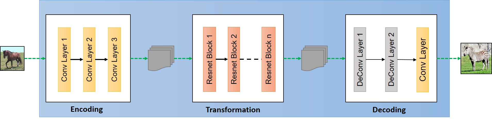
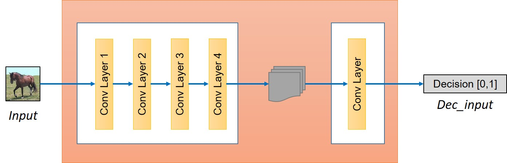

# CycleGAN
Tensorflow implementation of CycleGAN.

## Hackathon Notes

### Installation
- Create a virtual environment
```
$ python -m venv env
```
- Activate virtual environment
- Install dependencies
```
$ pip install -r requirements.txt
```

### Contribution
- Fork repository
- Create branch
- Make changes
- Create Pull Request
- Get a review
- Merge
- Delete branch

### CycleGAN model
1. [Original implementation](https://github.com/junyanz/CycleGAN/)
2. [Paper](https://arxiv.org/abs/1703.10593)
3. Big part of code and readme taken from: https://github.com/hardikbansal/CycleGAN

CycleGAN model can be summarized in the following image. For full details about implementation and understanding CycleGAN you can read the tutorial at this [link](https://hardikbansal.github.io/CycleGANBlog/)


<p align="center">

</p>

##### Generator


<p align="center">

</p>

##### Discriminator

<p align="center">

</p>


